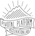

#  Welcome

As the Platform Acceleration Lab is a hands-on coding course, it will be
helpful for you to come prepared to the first class.
We will run through a quick exercise that will ensure that you have the
correct software installed.
After completing this exercise take some time to familiarize yourself
with these technologies.

# Package manager

We suggest using a package manager to install course software.

- **MacOS:**

    [Homebrew](https://brew.sh/) (`brew search PACKAGE` to search; see
    also `brew info FORMULA`, `brew service --help`)

- **Windows:**

    [Chocolatey](https://chocolatey.org/) (`choco search FILTER` to
    search)

- **Debian-Based Linux:**

    [Apt](https://wiki.debian.org/Apt) (`apt search PACKAGE` to search)

# Bash terminal

We will be using a bash terminal for development throughout the course.
On MacOS we prefer [iTerm](https://www.iterm2.com/) and on Windows we
prefer [Git Bash](https://git-scm.com/downloads).
There are many great terminal applications for Linux.

Some Windows command line utilities do not work well with Git Bash.
In these cases we like to use [PowerShell](https://microsoft.com/powershell),
which is installed by default on Windows.

# Code Organization

All of the software we write during the course will go in a
`~/workspace` directory.
All course code repos will be nested under this directory.

Open your bash terminal and use it to create this directory now.

```bash
mkdir ~/workspace
cd ~/workspace
```

# Git

Git will be used to access course materials and publish our results.

- **MacOS:**

    Git is included in the MacOS Command Line Tools, which you can
    install with:
    
    ```bash
    xcode-select --install
    ```

- **Windows:**

    Git is bundled with Git Bash, which you installed above.

- **Debian-Based Linux:**

    ```bash
    sudo apt install git
    ```

Here is a helpful Git [refresher](https://try.github.io), if you are a
bit rusty.

Once Git is installed, clone this sample project and go to its
directory.
```bash
cd ~/workspace
git clone https://github.com/platform-acceleration-lab/prerequisite-code.git
cd prerequisite-code
```

# Java

[Download](http://www.oracle.com/technetwork/java/javase/downloads/jdk8-downloads-2133151.html)
an install an up-to-date version of Java.
After installation, if
```bash
java -version
```
does not return the correct version then you may need to configure
`JAVA_HOME`.

Once Java is installed build the sample project.

- **Linux and MacOS:**
    ```bash
    ./gradlew build
    ```

- **Windows:**
    ```bash
    gradlew build
    ```

We can build with the [gradle wrapper script](https://docs.gradle.org/current/userguide/gradle_wrapper.html)
since we included a gradle wrapper with the repository.

# IntelliJ

We strongly recommend using [IntelliJ](https://www.jetbrains.com/idea/)
as your IDE.
IntelliJ offers [many advantages](https://blog.jetbrains.com/idea/2016/03/enjoying-java-and-being-more-productive-with-intellij-idea/)
over its competitors, especially when developing distributed systems.

IntelliJ offers a free [Community Edition](https://www.jetbrains.com/idea/features/editions_comparison_matrix.html)
that is sufficient for the course.
However, for professional uses we advise using the Ultimate Edition.
It offers significant advantages over the Community Edition such as

- Spring Framework support
- Javascript support
- SQL support
- Many more plugins

The time you save and insights you gain into your code will far outweigh
the cost of the Ultimate edition.

Once IntelliJ is installed, [configure your JDK](https://www.jetbrains.com/help/idea/2017.1/working-with-sdks.html?search=sdk#manage_sdks).
Next, open the sample project.
Edit the controller to return the string `I'm ready for PAL`.

```java
@GetMapping
public String message() {
    return "I'm ready for PAL";
}
```

# Cloud Foundry

First, install the Cloud Foundry CLI

- **MacOS:**
    ```bash
    brew install cloudfoundry/tap/cf-cli
    ```

- **Windows and Linux:**
    Navigate to the [CF CLI download page](https://github.com/cloudfoundry/cli/releases)
    and install the latest release.

    On Windows, we recommend using the CF CLI with the command prompt or
    with PowerShell, as there are some known issues using the CLI with
    Git Bash.

Next, sign up for a [free trial account](https://account.run.pivotal.io/z/uaa/sign-up)
for [Pivotal Web Services](https://run.pivotal.io/faq/).
[Login](https://github.com/cloudfoundry/cli/#getting-started) to your
new account with the CF CLI
```bash
cf login -a api.run.pivotal.io
```

# Deploy to CF

Build your application again, then push it to Cloud Foundry

- **Linux and MacOS:**
    ```bash
    ./gradlew build
    cf push
    ```

- **Windows:**
    ```bash
    gradlew build
    cf push
    ```

You will see some output when the deployment is complete.
Your app's route will be displayed in the output after `urls: `.

```no-highlight
requested state: started
instances: 1/1
usage: 1G x 1 instances
urls: prerequisite-combinable-disenthronement.cfapps.io
last uploaded: Mon May 1 20:07:36 UTC 2017
stack: cflinuxfs2
buildpack: java_buildpack

     state     since                    cpu    memory         disk           details
#0   running   2017-05-01 02:08:19 PM   0.0%   353.5M of 1G   137.1M of 1G
```

Visit your app's url in a browser to make sure that it has deployed
correctly.
If everything is working you should see your message
`I'm ready for PAL`.

# Submit your results

Once you are confident that your app is running, you are ready to
submit.
Edit the `build.gradle` file, filling in your email address and provided
cohort identifier.

```groovy
assignments {
    apiUrl = "https://pal-caddy.cfapps.io"
    email = "YOUR EMAIL GOES HERE"
    cohortIdentifier = 999999
}
```

Submit you prerequisite status to us with the following command.
The `prerequisiteUrl` must be a fully-qualified url (it must include
`http://`).

- **Linux and MacOS:**
    ```bash
    ./gradlew submitPrerequisites -PprerequisiteUrl=http://your-app-url
    ```

- **Windows:**
    ```bash
    gradlew submitPrerequisites -PprerequisiteUrl=http://your-app-url
    ```

If you see `BUILD SUCCESSFUL` then you are done.
If you see `BUILD FAILED` then check your app's deployment and fix any
errors.

# Other software

Install the following packages using either your package manager or the
provided links.

- MySQL ([download](https://dev.mysql.com/downloads/installer/))
- Gradle ([download](https://gradle.org/install/#manually))
- Maven ([download](https://maven.apache.org/guides/getting-started/windows-prerequisites.html))
- MongoDB ([download](https://docs.mongodb.com/manual/tutorial/install-mongodb-on-windows/))
- RabbitMQ ([download](https://www.rabbitmq.com/install-windows.html))
- Flyway ([download](https://flywaydb.org/getstarted/download))
- TomEE Plume (`tomee-plume` on Homebrew or [download](http://tomee.apache.org/installing-tomee.html)).
  Get the one named _WebProfile (NOT JavaEE7 certified)_.
- Graphviz ([download](http://www.graphviz.org/))
- Minio ([download](https://www.minio.io/downloads.html))
- Redis (`redis` on Homebrew or Chocolatey, `redis-server` on apt
  [download](https://redis.io/download))
- NGINX ([download](https://nginx.org/en/download.html))

# References

Check out the [PAL links](https://platform-acceleration-lab-links.cfapps.io/)
for recommended reading.
